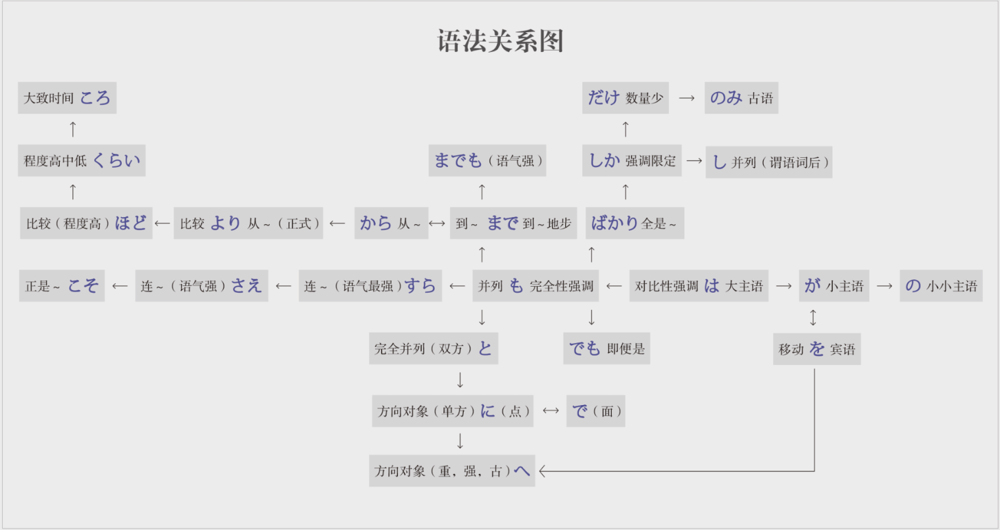

教材 《日语语法新思维(初级)》安宁

**～は**

<u>大主语</u>： <ruby>荒<rt>あら</rt>川<rt>かわ</rt></ruby>さん**は**イタリア<ruby>語<rt>ご</rt></ruby>が<ruby>上<rt>じょう</rt>手<rt>ず</rt></ruby>です。

<u>强调</u>： <ruby>彼<rt>かれ</rt></ruby>は<ruby>事<rt>じ</rt>務<rt>む</rt>所<rt>しょ</rt></ruby>に**は**いません。

<u>对比</u>： スイカ**は**<ruby>好<rt>す</rt></ruby>きだけど、<ruby>桃<rt>もも</rt></ruby>**は**<ruby>苦<rt>にが</rt>手<rt>て</rt></ruby>です。

**～が**

<u>小主语</u>： <ruby>荒<rt>あら</rt>川<rt>かわ</rt></ruby>さんはイタリア<ruby>語<rt>ご</rt></ruby>**が**<ruby>上<rt>じょう</rt>手<rt>ず</rt></ruby>です。

<u>强调主语</u>： <ruby>鵜<rt>う</rt>飼<rt>かい</rt></ruby><ruby>先<rt>せん</rt>生<rt>せい</rt></ruby>**が**この大学の<ruby>学<rt>がく</rt>長<rt>ちょう</rt></ruby>です。

**～を**

<u>把</u>： 字**を**<ruby>五<rt>ご</rt>回<rt>かい</rt>書<rt>か</rt></ruby>きました。

<u>移动</u>： 鳥は空**を**<ruby>飛<rt>と</rt></ruby>んでいます。

**～の**

<u>所属关系</u>：  服**の**ボタンがとれています。

<u>接续</u>： 私はこ**の**会社**の**<ruby>経<rt>けい</rt>理<rt>り</rt></ruby>**の**<ruby>三<rt>み</rt>浦<rt>うら</rt></ruby>です。

<u>代替名词</u>： これは<ruby>船<rt>ふな</rt>井<rt>い</rt></ruby>さん**の**<ruby>書<rt>しょ</rt>類<rt>ろい</rt></ruby>です。<ruby>谷<rt>たに</rt>村<rt>むら</rt></ruby>さん**の**は明日<ruby>持<rt>も</rt></ruby>ってきます。

<u>小小主语</u>：<ruby>五十嵐<rt>いがらし</rt></ruby>さん**は**、私**が**日本にいる時の一番<ruby>仲<rt>なか</rt></ruby>**の**いい友達でした。 （は（大主语）＞が（小主语）＞の（小小主语）

**～へ**

<u>方向，往</u>：<ruby>東<rt>ひがし</rt></ruby>**へ**行ってください。

<u>对象，给</u>：これは<ruby>恩<rt>おん</rt>師<rt>し</rt></ruby>**へ**の手紙です。 （「へ」后面可以加「の」或「と」，但是「に」不能）

**～に**

<u>方向，往、朝、向</u>：<ruby>速<rt>はや</rt></ruby>く<ruby>家<rt>いえ</rt></ruby>**に**<ruby>帰<rt>かえ</rt></ruby>りたい。

<u>对象，对、跟</u>：先生**に**<ruby>相<rt>そう</rt>談<rt>だん</rt></ruby>してください。

<u>目的</u>：駅まで友達を<ruby>迎<rt>むか</rt></ruby>え**に**行く。

<u>目标</u>：目標**に**<ruby>向<rt>む</rt></ruby>かって頑張る。

<u>时间点</u>：朝六時半**に**起きる。 （具体时间（非具体的时间后面不加「に」）

**～で**

<u>在某地做某事</u>：これは学校**で**<ruby>教<rt>おそ</rt></ruby>わりました。

<u>交通工具</u>：今日は車で来ました。

<u>方法</u>：日本語でどう言いますか。

<u>程度</u>：形式はある程度では決まっています。

<u>范围</u>：この塾ではたくさんの学生が習っています。

<u>状态</u>：これでいいですか。

<u>原因</u>：風邪で休んだ。

TODO: to be added... 

<u>主观原因</u>： 内陸だ**から**、空気が乾燥している。

<u>客观原因</u>： 経験がまだ浅い**ので**、宜しくお願いいたします。

**～が**

<u>顺接</u>： 失礼です**が**、お名前を教えていただけませんか。（口语是「けれども→けれど→けど）

<u>转折</u>： メールを出した**が**、先方からの返事はまだ来ていない。

<u>省略</u>： こちらのほうが正しいと思います**が**…

