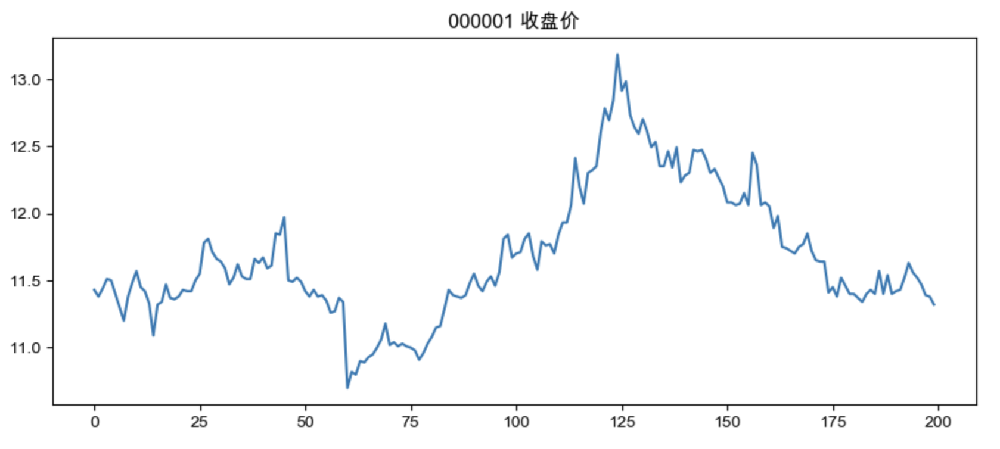

# 🌟 Hanz · Day 1 轻度任务

### 🔵 **任务 A：金融微任务（轻度）**

**主题：折现（Discounting）到底是什么？**

**步骤：**

1. 阅读这句话（核心精华）：
    👉 **折现 = 把未来的钱换算成今天等价的价值。**
2. 用你自己的话回答这两个问题（随便写，不要求正确）：
    **（1）为什么未来的 100 元不等于今天的 100 元？**
    **（2）你觉得折现的“直觉意义”是什么？**

我会根据你的回答告诉你：

- 你的理解哪里非常到位
- 哪些地方需要补充
- 给你一个“专业但很好懂”的折现实例

------

### 🟢 **任务 B：Python 微任务（轻度）**

**主题：读取一只股票的数据并打印前五行**

你运行下面这段代码（直接复制即可）：

```python
import akshare as ak

df = ak.stock_zh_a_hist(symbol="000001", start_date="20240101", end_date="20241231")
print(df.head())
```

**你要做的：**

- 运行代码
- 截图或复制输出
- 告诉我有没有成功
- 如果报错，也发给我，我帮你解决

我会告诉你：

- 代码有没有问题
- 输出的每一列是什么意思
- 这个数据未来怎么用在量化里

------

### 🟣 **任务 C：量化微任务（轻度）**

**主题：画出 000001 的收盘价折线图**

在任务 B 的基础上再运行：

```python
import matplotlib.pyplot as plt

df['收盘'].plot(figsize=(10, 4))
plt.title("000001 收盘价")
plt.show()
```

**你要做的：**

- 发图给我（截图即可）
- 告诉我图的形状是什么样子（上升？下降？震荡？）

我会帮你分析：

- 图里有什么信息
- 收盘价曲线如何帮助我们做策略
- 下一步可以做什么（均线、动量）

------

# 🔵 任务 A：折现（Discounting）

### 概念

折现的核心功能：

- 把未来的金额换算成今天的等价值，形成可比较的标准。

未来的钱价值更低，因为包含三种因素：
1. 通胀（Purchasing Power）：未来购买力下降
2. 风险溢价（Risk Premium）：未来不确定，需要补偿风险
3. 机会成本（Opportunity Cost）：今天的钱可以用于其他可能赚钱的用途

折现的本质：
- 统一不同时间点的价值尺度
- 让投资、估值、收益比较变得可行

折现的主要应用：
- 公司估值（DCF）
- 债券定价
- 项目评估（NPV/IRR）
- 股票估值（DDM）
- 量化策略收益评估

折现就是把未来的钱拉回当下，同时考虑通胀、风险和机会成本。如果折现后的价值比今天花出去的钱大，那就是赚的。

**折现是将未来现金流在通胀、风险溢价和机会成本等因素的影响下，换算成当期价值的过程。若折现后的总现值大于当前投资成本，则净现值（NPV）为正，投资能够创造额外收益。**

### 应用

五个关键金融场景：

**① 项目投资 – 判断是否值得做（NPV）**

一个项目会在未来 10 年产出现金。折现把未来的现金流拉回“今天的价值”，如果大于成本 → 值得投资。

**② 公司估值（DCF 公司估值模型）**

所有上市公司估值几乎都靠折现法（DCF）。一个公司未来 10 年赚多少钱 → 折现 → 得出它今天的价值。做股票时会用到。

③ **债券定价（Bond Pricing）**

未来的每期利息也要折现。折现后的价值和当前市场价比对，判断贵还是便宜。

④ **股票估值（股息折现模型 DDM）**

未来股息 → 折现 → 当前价值。

⑤ **量化策略 – 计算收益的真实价值**

比如策略回测中的：

- 年化收益率
- 夏普比率
- 真实收益

都要经过折现逻辑来理解“时间价值”。

### 计算

🌟 一、折现“使用哪一个比率”？——三大主流标准（实际应用）

折现率通常来自三类“市场上实际存在的回报率”。你理解它们，你就能在实际项目、股票估值、量化回测中套用。

------

**① 无风险利率（Risk-Free Rate）**

适用场景：

- 国债定价
- 折现未来的“确定收益”（如银行存款）
- 做基准比较（CAPM 的基础）

一般取值：

- 中国：10 年期国债收益率
- 美国：10 年期 Treasury Yield

例如（假设）： **3% / 年**

作用：只是把**时间价值和通胀**考虑进去。

------

**② 公司折现率（WACC）**

适用场景：

- 公司估值（DCF 模型）
- 项目投资决策（NPV）
- 并购、融资评估

WACC 包含：

- 借钱的成本（债务成本）
- 融资成本（股权成本）
- 权重（资产结构）

一般企业 WACC 可能是：**8% ~ 15% / 年**

折现率越高 → 未来越不值钱 → 项目越难通过
 折现率越低 → 更容易通过项目

------

**③ CAPM 模型算出来的“股权成本”**（最常用于股票）

CAPM：**股权成本 = 无风险利率 + β ×（市场风险溢价）**

例子：

- 无风险利率 = 3%
- β = 1.2
- 市场风险溢价 = 6%

股权成本 = 3% + 1.2 × 6% = **3% + 7.2%= 10.2%**

适用场景：

- 折现股票未来的现金流
- 做股票估值
- 做项目的股东回报要求

------

🌟 二、那折现“如何带入数据”？——给你三个最常用公式

折现的核心公式：

------

**① 单笔未来现金折现**

未来一年后得到 FV：
$$
 PV = \frac{FV}{(1+r)}
$$
三年后：
$$
 PV = \frac{FV}{(1+r)^3}
$$

------

**② 多期现金流折现（DCF）**

$$
 PV = \sum_{t=1}^{n} \frac{CF_t}{(1+r)^t}
$$

这是股票估值和项目投资最核心的公式。

------

**③ 净现值（NPV）**

$$
 NPV = PV - 投资成本
$$

NPV > 0：赚 

NPV < 0：亏

------

🌟 三、最关键：给你一个“真实、完整、专业的例子”

 **“如何把数据带入？”**

我给你一个企业项目投资的真实例子，让你一眼看懂折现怎么实际计算。

------

📘 **例子：一个项目未来三年每年盈利多少？值不值得投？**

假设某项目需要你投资**成本 = 100 万元**

未来的预期现金流：

| 年份  | 现金流 CF |
| ----- | --------- |
| 第1年 | 50 万     |
| 第2年 | 60 万     |
| 第3年 | 70 万     |

假设该行业平均 WACC = **10%**

我们要算： **这个项目的价值（折现后的价值）是多少？是不是大于 100 万？**

------

📌 第一步：逐年折现

**第 1 年折现**

$$
 PV_1 = \frac{50}{1.10} = 45.45
$$

**第 2 年折现**

$$
 PV_2 = \frac{60}{1.10^2} = 49.59
$$

**第 3 年折现**

$$
 PV_3 = \frac{70}{1.10^3} = 52.57
$$

------

📌 第二步：把现值加起来

$$
 PV_{\text{total}} = 45.45 + 49.59 + 52.57
 = 147.61\text{万}
$$

------

📌 第三步：算 NPV

$$
 NPV = 147.61 - 100
 = 47.61\text{万}
$$

✨ **结论：这个项目值得做，因为折现后仍然能额外创造 47.61 万价值。**

这就是折现在真实场景中的使用方式。

------

🌟 四、给你一个“股票 DCF 估值”的真实例子（更贴近你未来的量化方向）

假设：
 某公司未来五年能创造如下自由现金流：

| 年份 | FCF（亿） |
| ---- | --------- |
| 1    | 10        |
| 2    | 12        |
| 3    | 14        |
| 4    | 15        |
| 5    | 16        |

折现率（股权成本）= **10%**（由 CAPM 得来）

你只需把五年现金流分别折现，再加总。

第五年之后的成长用永续模型算，这就是专业的 DCF 模型。

（你之后学到量化估值的时候会非常常用。）

------

🌟 五、给你一个“量化回测中的折现应用”例子（你未来会经常用）

当你算策略的真实收益，就要考虑：

$$
 \text{真实收益} = \frac{未来的价值}{(1+r)^t}
$$

例如：

- 你的策略收益 20%
- 但无风险利率 3%
- 风险溢价 5%

你需要对超额收益做折现，得到真正的“风险调整后收益”。

------

🌈 六、我把你的问题总结成 Markdown（你可以直接存入知识库）

```markdown
# 折现率的选择与折现计算示例

## 1. 折现率来源
### 1.1 无风险利率（Risk-Free Rate）
- 通常选择10年期国债收益率

### 1.2 WACC（加权平均资本成本）
- 用于公司估值、项目投资

### 1.3 CAPM（股权成本）
- r = Rf + β × MRP

---

## 2. 单期与多期折现公式
PV = FV / (1+r)^t

NPV = Σ CF_t / (1+r)^t − 初始投资

---

## 3. 实际例子：项目投资折现
投资成本：100 万  
折现率：10%

未来现金流：
1年：50 万  
2年：60 万  
3年：70 万  

折现：
- 50 / 1.1 = 45.45
- 60 / 1.1^2 = 49.59
- 70 / 1.1^3 = 52.57

总现值 = 147.61 万  
NPV = 147.61 − 100 = 47.61 万 → 项目值得做。
```

------

🌟 七、下一步可以选择：

1. **用 Python 写出折现计算（DCF 代码）**
2. **继续扩展折现率选择（WACC, CAPM 完整推导）**
3. **学习 NPV/IRR 的进一步应用**
4. **进入“量化算法中的折现”**


# 🟢 任务 B：运行代码结果

输出如下（摘取关键部分）：

```
           日期    股票代码    开盘    收盘    最高    最低      成交量           成交额    振幅  
0  2024-01-02  000001  9.39  9.21  9.42  9.21  1158366  1.075742e+09  2.24   
1  2024-01-03  000001  9.19  9.20  9.22  9.15   733610  6.736736e+08  0.76   
...
```

说明：

- akshare 成功安装 ✔
- API 正常工作 ✔
- 数据成功获取 ✔
- DataFrame 输出格式正确 ✔

Python 环境已能流畅运行财经数据。

### ✅ **二、这些列分别是什么意思？（量化必备）**

直观专业解释：

| 列名         | 意义                       | 在量化中的作用                    |
| ------------ | -------------------------- | --------------------------------- |
| **日期**     | 交易日日期                 | 用作索引、回测日期对齐            |
| **股票代码** | 例如 000001                | 多股票回测时用来区分              |
| **开盘**     | 当天开盘价                 | 做**T+1回测**时，用作“执行买卖价” |
| **收盘**     | 当天收盘价                 | 最常用的数据：计算收益、指标、K线 |
| **最高**     | 当天最高价                 | 用于极值、风险监控（如振幅）      |
| **最低**     | 当天最低价                 | 同上，用来判断波动、止损策略      |
| **成交量**   | 当天成交量（手）           | 做量价策略（如均量、反转）        |
| **成交额**   | 当天成交金额（元）         | 大单流入/机构行为分析             |
| **振幅**     | (最高-最低)/前收盘 ×100%   | 波动率指标之一                    |
| **涨跌幅**   | (收盘-前收盘)/前收盘 ×100% | 核心收益率，用于策略收益计算      |
| **涨跌额**   | 当日涨跌的金额             | 不常用，但可用于定价逻辑          |
| **换手率**   | 交易量/流通股              | 流动性评估、“热度”判断            |

已经能读取到最关键的量化基础数据，这就是绝大部分初级策略的基础。

### ✅ **三、这些数据未来怎么用？**

刚完成的是量化最基础的一步：**获取并理解行情数据**。接下来，这些数据会被用于：

------

**① 构建技术指标（MA、EMA、RSI、MACD 等）**

例如：

- MA10 = 收盘价的10日均线
- RSI = 计算超买/超卖
- MACD = 趋势

所有指标都需要收盘价、成交量。

------

**② 策略信号计算**

比如：

- MA5 上穿 MA20 → 做多信号
- RSI < 30 → 可能反转
- 连续3天涨幅为负 → 机会

这些信号全部依赖你刚刚的 DataFrame。

------

**③ 回测（Backtesting）**

你将用这些数据：

- 根据信号“模拟买卖”
- 用开盘价成交（中国 A 股 T+1）
- 记录收益曲线

------

**④ 可视化分析（绘制K线、走势）**

你刚开始使用 matplotlib，这个非常好。

下一步你可以绘制：

- 收盘价曲线
- 均线叠加
- 价格涨跌的柱状图

------

**⑤ 多股票数据组合（多因子、选股策略）**

未来你会扩展到：

```python
symbols = ["000001", "000002", "600519", "000300"]
```

自动循环获取所有股票数据，用于：

- 横截面动量
- 高频因子
- alpha 仓位管理

🟦 1. **横截面动量（Cross-sectional Momentum）**

✅ **一句话解释** 同一时点，比较一堆股票，看谁“比较强”（涨得更好），就买强者、卖弱者。

📌 举例 现在有 5 只股票：

| 股票 | 最近3个月涨幅 |
| ---- | ------------- |
| A    | +20%          |
| B    | +15%          |
| C    | +5%           |
| D    | -2%           |
| E    | -10%          |

横截面动量做的事就是：

- 选涨幅排名 **前 20%**：买 A、B
- 躲避或做空 **后 20%**：卖 D、E

📌 为什么叫“横截面”（cross-sectional）？

因为不是看一个股票的时间序列，而是：

👉 **同一天，横切市场，把股票相互比较谁强谁弱。**

📌 在量化中的用途

- 最经典的选股因子之一
- 可以构建“强者恒强”策略
- ETF 也能用（比较行业 ETF 的强弱）

📌 你未来会这样写：

```python
df['return_3m'] = df['close'].pct_change(60)
top = df.sort_values('return_3m').tail(50)   # 买最强 50 只
```

------

🟦 2. **高频因子（High-frequency Factor）**

这个词听起来很“高端”，但核心思想很简单。

✅ **一句话解释**

利用**分钟级**（甚至秒级）数据提取的“微观价格行为特征”，来捕捉短期机会。

📌 举例：秒级或分钟数据

一只股票的价格每 1 分钟变化如下：

```
10:00  10.01
10:01  10.05
10:02  10.06
10:03  10.02
10:04  10.03
```

你可以从这些数据构造因子，例如：

- **短期价格动量**：近 3 分钟是不是持续上涨？
- **量价关系**：成交量突然放大是否预示着突破？
- **反转因子**：价格连续快速下跌后是否马上反弹？

📌 高频因子有什么特点？

- 用的数据频次高（tick、1分钟线、5分钟线）。
- 信号反应更快。
- 但需要更好的执行环境（实盘才需要）。
- 回测也更复杂。

📌 你以后用 akshare 也可以获取分钟级数据：

```python
df = ak.stock_zh_a_minute(symbol="000001", period="1")
```

这就是高频策略的数据基础。

------

🟦 3. **alpha 仓位管理（Alpha Portfolio / Alpha Weighting）**

这是量化投资的核心思想之一。

✅ **一句话解释**

你从各个因子（动量、价值、波动率等）得到“预期收益预测”（alpha），
 然后根据这些预测决定每只股票的**仓位（权重）**。

------

### 📌 举例

你现在有三个因子：

| 股票 | 因子1动量 | 因子2价值 | 因子3波动率 | 综合 alpha |
| ---- | --------- | --------- | ----------- | ---------- |
| A    | 0.8       | 0.3       | 0.2         | 0.6        |
| B    | -0.3      | 0.5       | 0.1         | 0.1        |
| C    | 0.2       | -0.1      | -0.5        | -0.2       |

alpha 数字越大，未来涨的概率越高。

📌 如何变成仓位？

常见方法：

1. **按比例分配**

   ```
   weight = alpha / sum(alpha+)
   ```

2. **买前20% alpha，卖后20% alpha**

3. **目标波动率分配（风险平价）**

📌 alpha 仓位管理的意义

- 你不再“凭感觉买股票”
- 而是**让数学告诉你该买多少、卖多少**
- 多因子策略就是这样组合出来的

你未来会这样写：

```python
weights = alphas / alphas.sum()
portfolio_return = (weights * next_day_returns).sum()
```

------

🟦 4. 三者关系总结（你能立刻理解）

| 概念               | 做的事                 | 数据需求    | 在量化中的位置 |
| ------------------ | ---------------------- | ----------- | -------------- |
| **横截面动量**     | 比较股票强弱，买强卖弱 | 日线        | 因子之一       |
| **高频因子**       | 分钟级数据挖模型特征   | Tick/分钟线 | 高频策略核心   |
| **Alpha 仓位管理** | 根据因子得分决定买多少 | 因子结果    | 组合构建       |

一句话串起来：

👉 你先用“横截面动量”“高频因子”等产生 alpha，然后用 alpha 仓位管理生成实际的投资组合。

# 🟣 任务 C：画图

🟣 你的图是否正确？



是的，**完全正确**。

- 横轴是交易日序号（0 到约 200）
- 纵轴是价格（11 元到 13.2 元之间）
- 标题显示正常
- 曲线走势清晰，没有乱码
   这表明你的 pandas、matplotlib、akshare 组合已经能顺利跑通，这是量化学习的核心基本操作。

------

### 🟣 你的图是什么形状？

从你显示的曲线可以看出：

👉 **总体是“震荡上升 → 板块泡沫 → 回落”结构。**

更细一点看：

1. **前期（0–80）缓慢震荡**

- 价格在 11.0–11.7 区间波动
- 没有明显趋势
- 属于低波动、横盘结构

2. **中期（约 80–130）快速上升**

- 80 之后开始抬升
- 在 125 左右达到最高点（约 13.3）
- 这是一段明显的 **趋势行情 / 上涨动量段**

3. **后期（130–200）震荡回落**

- 价格从高位回落到约 11.5–11.3
- 呈下行结构

总体形状像一个“山峰”：
 **慢慢爬坡 → 中间大涨 → 再回落下山。**

这在量化里非常常见，叫：

**“先震荡 → 突破 → 见顶 → 回调”**

------

### 🟣 收盘价曲线能告诉我们什么？

1. **趋势是否存在**

你看到中间这段明显上涨，这告诉我们：

- 均线策略（MA10、MA20）在这段时期会有不错的表现
- 动量因子在这一段会捕捉到强势上涨

2. **波动状态**

前期波动很小 → 可以试探低风险策略
 中期波动变大 → 适合趋势策略
 后期下跌 → 均线策略会自动退出

3. **关键节点（支撑位和阻力位）**

虽然你现在还不做技术分析，但折线图本身已经告诉你：

- ~11 元附近是强支撑（反复回落到这个位置）
- 13.3 元附近是阶段高点

这些都能帮助你理解“为什么策略要用均线/EMA/动量”。

------

🟣 下一步任务（任务 D：轻度→中度过渡）

如果你愿意继续，我建议你做：

🟢 **任务 D：画出 5 日均线 + 20 日均线（MA5 / MA20）**

通过它你能看到：

- 为什么均线能捕捉趋势
- 为什么均线金叉/死叉能作为简单策略
- 为什么很多策略只依赖收盘价就能赚钱

### 🔵 **K线图（Candlestick Chart）** 

绘制 **K线图（Candlestick Chart）** 是量化里非常基础、非常实用的一步，我会用最简单、最稳定的方式带你完成。

你现在的 akshare + pandas 环境完全能渲染 K 线图，我们只需要再加一个库：

#### 🟢 **方法一（最推荐）——使用 mplfinance（最简洁、最稳）**

这是目前 Python 里画 K 线最干净、最兼容的方式。

------

🔧 第一步：安装 mplfinance

在你的终端或 PyCharm 的 Terminal 输入：

```bash
pip install mplfinance
```

或者（如果你在 micromamba 环境里）：

```bash
mamba install -c conda-forge mplfinance
```

------

🔧 第二步：整理 akshare 数据格式

mplfinance 需要 **列名是英文**：`Open, High, Low, Close, Volume`
 而 akshare 的列名是中文：`开盘, 收盘, 最高, 最低, 成交量`

我们需要 **重命名**，这一步很关键。

------

🔵 完整代码（复制即可运行）

```python
import akshare as ak
import mplfinance as mpf
import pandas as pd

# 获取数据
df = ak.stock_zh_a_hist(symbol="000001", start_date="20240101", end_date="20241231")

# 转换为 pandas 可识别的格式
df = df.rename(columns={
    "日期": "Date",
    "开盘": "Open",
    "收盘": "Close",
    "最高": "High",
    "最低": "Low",
    "成交量": "Volume"
})

# 转换日期为索引
df["Date"] = pd.to_datetime(df["Date"])
df = df.set_index("Date")

# 绘制 K 线图
mpf.plot(
    df,
    type="candle",           # 蜡烛图
    style="yahoo",           # 美观主题
    volume=True,             # 显示成交量
    title="000001 K线图",
    mav=(5, 20),             # 加 5日 & 20日 均线
    figsize=(12, 6)
)
```

------

🔍 运行后你会看到什么？

你会得到一个标准的完整 K 线图：

- 红绿色蜡烛（涨绿跌红）
- 上下影线
- 左边价格轴
- 下方成交量柱状图
- 上面叠加 5 日、20 日均线

看起来会像 TradingView 或同花顺那种专业 K线图。

------

🧠 小提醒：为什么量化需要 K线？

虽然量化主要走“收盘价驱动”，但 K 线图仍然帮助你：

- 观察趋势结构（阴线、阳线密度）
- 观察波动大小（上影线、下影线）
- 识别转折（锤子线、吞没形态等）
- 看成交量配合（量价关系）

这对你以后构建策略直觉很重要。

------

🟣 如果你愿意继续加深——我可以给你：

✔ 任务 E：绘制带布林带（Bollinger Bands）的 K 线图

✔ 任务 F：叠加 MACD、RSI 等技术指标

✔ 任务 G：多股 K 线对比（行业比较）

✔ 任务 H：做第一份简单的择时策略（均线金叉回测）

你下一步想做哪一个？

Hanz，你问得非常好。
 你现在已经会“画”K线，而接下来理解 **K线的原理**，意味着你开始掌握“金融图形背后的数学和交易逻辑”。这一步很关键，会让你以后读图、做策略都更扎实。

我会用**专业但好理解、清晰、务实**的方式，完整讲清楚 K 线图背后的机制和意义。

------

#### 🟦 **K线图的核心原理：用四个价格描述一整天（或一段时间）的全部市场行为**

K 线图之所以存在，是因为 **“一条价格曲线不足以描述市场的真实波动”**。

单纯看收盘价，只能看到每天一个点；
 但市场一天之中：

- 开盘价
- 曾经涨到哪里（最高）
- 曾经跌到哪里（最低）
- 收在哪儿（收盘）

这些信息非常关键：

👉 **四个价格 together 才能展现市场的“情绪、力量、争斗”。**

因此 K 线用这四个要素来总结整个周期：

| 名称                | 含义             | 描述市场行为               |
| ------------------- | ---------------- | -------------------------- |
| **开盘价（Open）**  | 第一笔成交价     | 市场当天的起点、短期预期   |
| **收盘价（Close）** | 最后一笔成交价   | 情绪的终点、主力力量的结果 |
| **最高价（High）**  | 当天的最高成交价 | 买方力量能把价格推多高     |
| **最低价（Low）**   | 当天的最低成交价 | 卖方力量能把价格压多低     |

K线的核心就是一句话：

> **用一个“蜡烛”记录市场在这一段时间内的博弈结果。**

------

🟦 **K 线的组成原理：实体 + 上下影线**

一根K线包含两部分：

------

① 实体（Body）

🌕 阳线（Close > Open）

表示收盘价高于开盘价，即：

👉 **这段时间市场“涨”为主，买方力量更强。**

🌑 阴线（Close < Open）

表示收盘价低于开盘价：

👉 **这段时间市场“跌”为主，卖方力量占优。**

涨跌颜色：

- 国内 → 习惯：红涨绿跌
- 国外 → 绿涨红跌

颜色无关原理，只是“方便看”。

------

② 影线（Shadows）

- **上影线 = 高点 - 最大（开、收）**
- **下影线 = 最小（开、收） - 低点**

影线告诉我们：

- 上影线长 → 曾被推高，但卖方强势压回
- 下影线长 → 曾急跌，但买方把盘拉回

影线长度反映**波动 + 力量对比**。

------

🟦 **K 线图为何能比折线图更“真实”？**

折线图只记录每日收盘价：

- 看不到日内冲高回落
- 看不到早盘找到跳空开盘
- 看不到下影线抢筹
- 看不到长上影压力

而 K 线图能呈现：

- 多空力量变化
- 市场情绪波动
- 关键价位冲击
- 支撑与压力
- 转折信号（针形线、吞没、十字星等）

换句话说：

👉 **折线图 = 结果
 👉 K 线图 = 整个过程**

量化虽然最后依赖“数字”，但图形是帮助理解市场结构的重要工具。

------

🟦 **为什么 K 线图是全球股票交易最常用的图表？**

因为它同时表现：

| 维度          | 折线图 | K线图 |
| ------------- | ------ | ----- |
| 展示收盘价    | ✔      | ✔     |
| 展示开盘价    | ❌      | ✔     |
| 展示最高/最低 | ❌      | ✔     |
| 展示波动范围  | ❌      | ✔     |
| 展示买卖力量  | ❌      | ✔     |
| 展示市场心理  | ❌      | ✔     |

因此：

> **K线图几乎是唯一能“把市场行为图像化”的工具。**

这也是为什么世界所有交易系统（TradingView、彭博、Wind）默认都是 K线。

------

🟦 **你现在理解的 K线图原理将直接帮助你做策略**

比如接下来你会看到：

✔ 均线系统（MA5 / MA20）

K线告诉你何时趋势变强、何时疲软。

✔ 布林带（Bollinger Bands）

K线的波动范围结合均线生成区间。

✔ K线形态信号

- 下影线长 → 抄底资金
- 上影线长 → 压力明显
- 十字星 → 多空僵持
- 吞没形态 → 强烈转势

✔ 动量策略

K线告诉你趋势是否连续、波动是否放大。

✔ 支撑位 / 阻力位

影线触碰的位置往往变成未来的支撑/压力。

你以后会慢慢发现：

👉 **理解 K线 = 理解市场的内部结构
 👉 理解市场结构 = 做策略的基础**

------

🟩 如果你愿意，我可以带你继续深入

你可以告诉我你想继续哪一项：

① **K线形态讲解（十字星、锤子线、吞没）——超实用、直觉增强**

② **在 K 线上叠加均线（MA5/MA20）并解释交叉信号**

③ **布林带 + K线图（非常直觉的策略）**

④ **MACD、RSI 技术指标和 K 线配合**

⑤ **写你的第一个 K 线策略：均线金叉自动回测**

