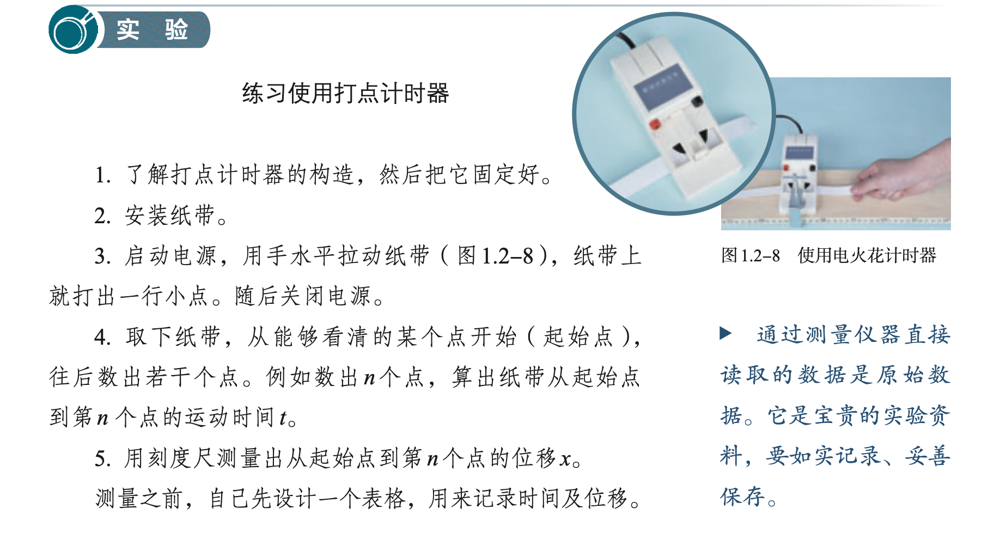
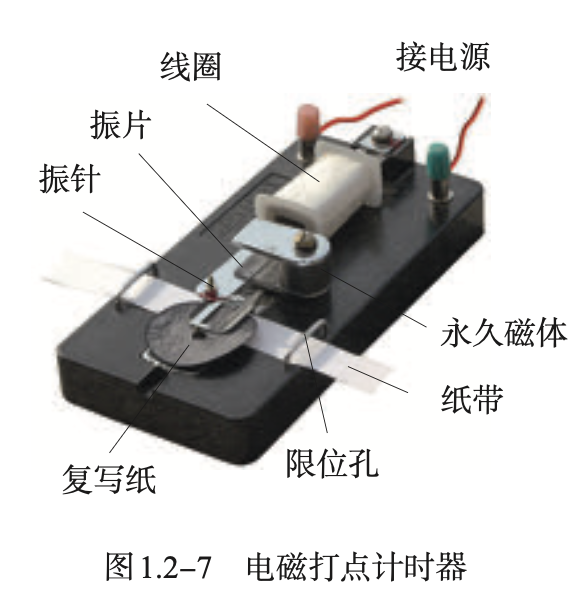
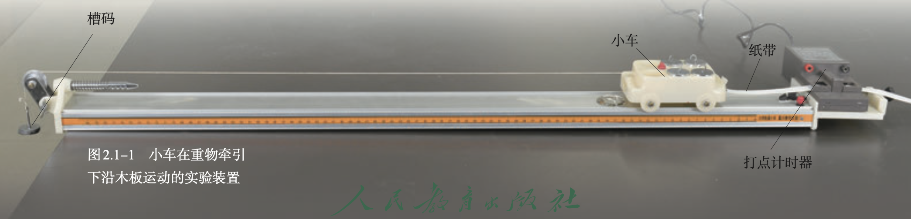

教材梳理:

问题：

1. 如何描述运动？

测量：电磁打点计时器

**匀变速直线运动**

牛顿三定律 $\rightarrow$ 重力与弹力 摩擦力

公式：

$v = v_0 + at$

$s = v_0t+\frac{1}{2}at^2$

$v^2-v_0^2=2as$

实验：

1. 探究小车速度随时间变化的规律——必修一 P37
2. 探究加速度与力、质量的关系——必修一 P88

物理史：

伽利略利用逻辑推理说明了重物与轻物下落得同样快，推翻了亚里士多德重物下落比轻物快的错误观念；制作了天文望远镜凭借观测结果支持日心说。他把实验和逻辑推理（包括数学演算）和谐地结合起来，于 1638 年出版了《两种新科学的对话》，奠定了作为近代力学创始人的地位。

## 定义

可以忽略物体的大小和形状，把它简化为一个具有质量的点，这样的点叫作**质点**（mass point） 。 ——必修一 P12 

描述一个物体的运动，用来作为参考的物体叫作**参考系**（reference frame） 。——必修一 P14

**路程**（path）是物体运动轨迹的长度。——必修一 P16

由初位置指向末位置的有向线段是**位移**（displacement）——必修一 P16 （引入矢量概念）

位移与发生这段位移所用时间之比表示物体运动的快慢，这就是**速度**（velocity）。在国际单位制中，速度的单位是**米每秒**， 符号是 m/s 或m·s-1。——必修一 P21 

物体在时间 Δ*t* 内运动的平均快慢程度，叫作**平均速度**（average velocity） 。c——必修一 P22

当 Δ*t* 非常非常小时，运动快慢的差异可以忽略不计，此时，我们就把 Δx/Δt 叫作物体在时刻t的**瞬时速度**（instantaneous velocity）。瞬时速度的大小通常叫作**速率**（speed）。——必修一 P22

物理学中把速度的变化量与发生这一变化所用时间之比，叫作**加速度**（acceleration） 。通常用 *a* 表示。若用 Δ*v* 表示速度在时间 Δ*t* 内的变化量，则有 *a*＝Δ*v*/Δ*t*。在国际单位制中，加速度的单位是**米每二次方秒**，符号是 m/s2 或 m·s-2。——必修一 P27

沿着一条直线，且加速度不变的运动，叫作**匀变速直线运动**（uniform variable rectilinear motion）。 ——必修一 P39

物体只在重力作用下从静止开始下落的运动，叫作**自由落体运动**（free-fall motion）。——必修一 P48

物体自由下落的加速度叫作**自由落体加速度**（free-fall acceleration），也叫作**重力加速度**（gravitational acceleration） ，通常用 *g*表示。——必修一 P49

物体间的相互作用是**力**（force）。——必修一 P56

由于地球的吸引而使物体受到的力叫作**重力**（gravity），单位是**牛顿**，简称**牛**，符号用 N 表示。——必修一 P57

 物体所受重力效果上看来的的集中作用点叫作物体的**重心**（center of gravity）。——必修一 P58

物体在力的作用下形状或体积会发生改变，这种变化叫作**形变**（deformation）。发生形变的物体，要恢复原状，对与它接触的物体会产生力的作用，这种力叫作**弹力**（elastic force）。——必修一 P59

物体在发生形变后，如果撤去作用力能够恢复原状，这种形变叫作**弹性形变**（elastic deformation）。如果形变过大，超过一定的限度，撤去作用力后物体不能完全恢复原来的形状，这个限度叫作**弹性限度**（elastic limit）。——必修一 P60

在弹性限度内，弹簧发生弹性形变时，弹力 *F* 的大小跟弹簧伸长（或缩短）的长度 *x*成正比， 即*F* ＝ *kx*，这个规律叫作**胡克定律**（Hooke’s law） 。式中弹力*F*、弹簧伸长（或缩短）的长度 *x* 的单位分别是牛顿（N）、米（m），*k* 叫作弹簧的**劲度系数**（coefficient of stiffness） ，单位是**牛顿每米**，符号是 N/m。——必修一 P61

两个相互接触的物体，当它们相对滑动时，在接触面上会产生一种阻碍相对运动的力，这种力叫作**滑动摩擦力**（sliding frictional force） 。滑动摩擦力的方向总是沿着接触面，并且跟物体相对运动的方向相反。**滑动摩擦力的大小跟压力的大小成正比**。*F*f ＝ *μF*压，其中，*μ* 是比例常数， 叫作**动摩擦因数**（dynamic friction factor） 。——必修一 P63

相互接触的两个物体之间只有相对运动的趋势，而没有相对运动，所以这时的摩擦力叫作**静摩擦力**（static frictional force） 。静摩擦力的方向总是跟物体相对运动趋势的方向相反。——必修一 P65

物体间相互作用的这一对力，通常叫作**作用力**（acting force）和**反作用力**（reacting force）。作用力和反作用力总是互相依赖、同时存在的。——必修一 P68

**两个物体之间的作用力和反作用力总是大小相等， 方向相反， 作用在同一条直线上。**这就是**牛顿第三定律** （Newton’s third law）。——必修一 P69

假设一个力单独作用的效果跟某几个力共同作用的效果相同，这个力就叫作那几个力的**合力**（resultant force）。假设几个力共同作用的效果跟某个力单独作用的效果相同， 这几个力 就叫作那个力的**分力**（component force）。——必修一 P72

我们把求几个力的合力的过程叫作**力的合成**（composition of forces） ，把求一个力的分力的过程叫作**力的分解** （resolution of force）。两个力合成时，如果以表示这两个力的有向线段为邻边作平行四边形，这两个邻边之间的对角线就代表合力的大小和方向。这个规律叫作**平行四边形定则** （parallelogram rule）。——必修一 P73

既有大小又有方向，相加时遵从平行四边形定则的物理量叫作**矢量**（vector） 。只有大小，没有方向，相加时遵从算术法则的物理量叫作**标量**（scalar）。——必修一 P75

**在共点力作用下物体平衡的条件是合力为 0**。——必修一 P76

物体怎样运动而不涉及运动和力的关系的分支，叫作**运动学**（kinematics）；研究运动和力的关系的分支，叫作**动力学**（dynamics）。——必修一 P82

**一切物体总保持匀速直线运动状态或静止状态，除非作用在它上面的力迫使它改变这种状态。**这就是**牛顿第一定律**（Newton’s first law） 。物体这种保持原来匀速直线运动状态或静止状态的性质叫作**惯性**（inertia） 。——必修一 P85

描述物体惯性的物理量是它的**质量**（mass） 。质量只有大小，没有方向，是标量。在国际单位制中，质量的单位是千克，符号为 kg。——必修一 P86

如果在一个参考系中，一个不受力的物体会保持匀速直线运动状态或静止状态，这样的参考系叫作**惯性参考系**，简称**惯性系**。以加速运动的纸为参考系，牛顿第一定律并不成立，这样的参考系叫作非惯性系。——必修一 P87

## 实验

### 实验器材

### 实验图

